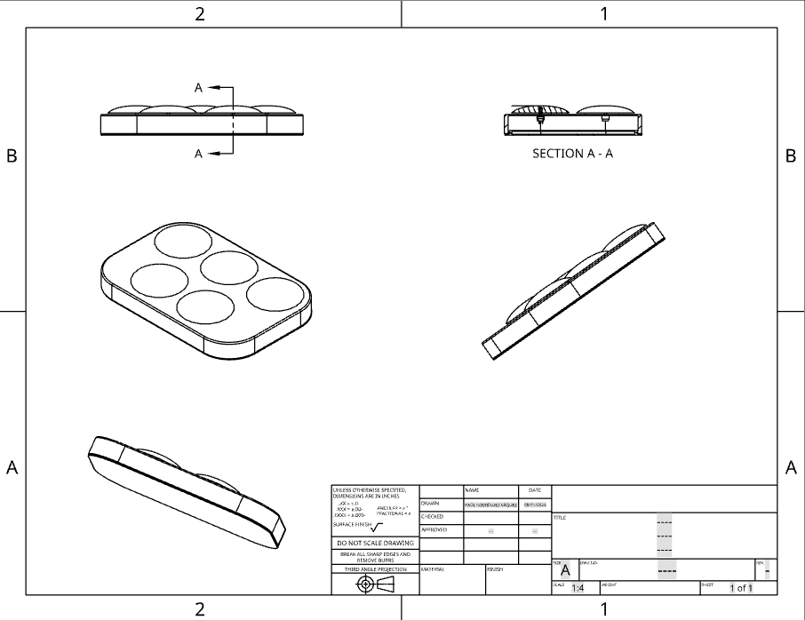
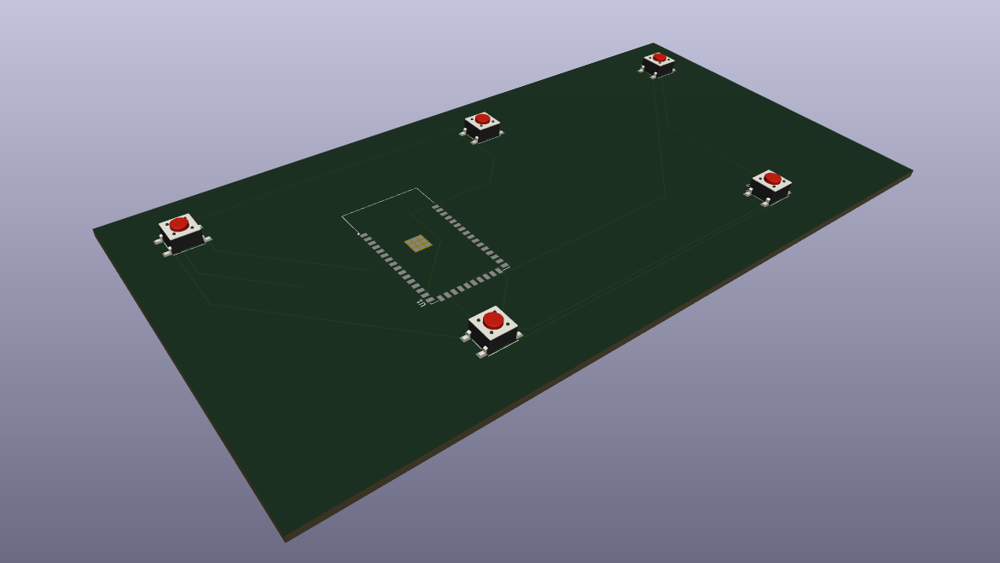
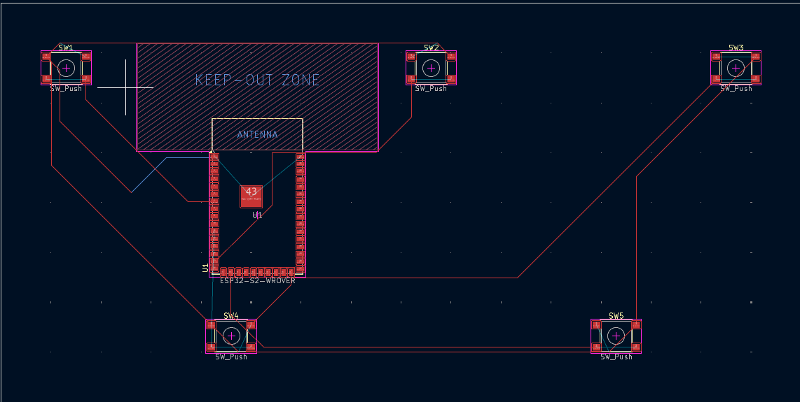
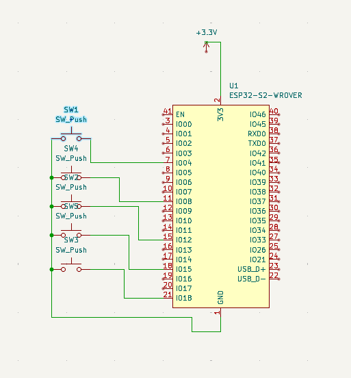

# Physics-Based Multiplayer Platformer 🎮✨

## Overview

This repository contains a physics-driven, multiplayer platformer game built with **p5.js** and **Matter.js**, targeting the Grade 11/12 ICS2/3x Programming curriculum. Key features include:

* **Procedural Level Generation** 🏗️: Chunks of varying types (flat, stairs, pits, swings, climbable sections) are generated in sequence.
* **Tethered Multiplayer** 🤝: Up to 4 players are connected by ropes, introducing cooperative mechanics.
* **Digital Countdown Timer** ⏲️: A 2-minute timer governs each play session.
* **Accessibility Keyboard** ♿⌨️: A custom BLE keyboard built on an ESP32 with 5 pushbuttons for alternative controls. This keyboard allows people with reduced mobility in their hands to play the game easily.
* **Custom PCB** 🛠️: Designed in KiCad to host the ESP32 and buttons.

---

## Table of Contents

1. [Design & Planning](#design--planning) 📝
2. [Installation and Setup](#installation-and-setup) 💻
3. [Game Controls](#game-controls) 🎮
4. [Code Structure](#code-structure) 🗂️
5. [Pseudocode](#pseudocode) 🧩
6. [Hardware Accessibility](#hardware-accessibility) ♿
7. [KiCad PCB Design](#kicad-pcb-design) 🛠️
8. [Future Improvements](#future-improvements) 🚀
9. [References](#references) 📚

---

## Design & Planning

Before writing code, the following steps were completed:

1. **Sketches** ✏️: Hand-drawn layouts showing:

    * Main menu with player-selection buttons
    * In-game HUD (timer, stamina bars)
    * Chunk types and transition logic
    * Graphics theme
    * Sprites style

2. **Specifications**:

    * **Audience**: Teens and beginner programmers.
    * **Unique Selling Point**: Cooperative, rope-tethered movement with procedurally generated chunks.
    * **Start/End**: Game starts at main menu; ends when timer runs out or players reach the end-zone.
    * **Scoring**: How fast the team gets the stolen piece into the endzone 🏁
    * **Challenge**: Random chunk sequences that adapt difficulty.
3. **Pseudocode**: High-level representations of core algorithms (see section below).

---

## Installation and Setup 💻

1. Clone the repo:

    ```bash
    git clone https://github.com/username/physics-platformer.git
    cd physics-platformer
    ```
2. Serve with a local HTTP server (required for `p5.js` assets):

    ```bash
    npx http-server .
    ```
3. Open `http://localhost:8080` in your browser.
4. Make sure the `assets/` folder is alongside `index.html`.

---

## Game Controls 🎮

* **Keyboard (default)**:

  * Player 1: W (jump), Q (left), E (right)
  * Player 2: X (jump), Z (left), C (right)
  * Player 3: O (jump), I (left), P (right)
  * Player 4: N (jump), B (left), M (right)
* **ESP32 BLE Keyboard** (alternative accessibility): 5 buttons mapped to jump/left/right for one player via BLE HID. Ideally everybody would have a different keyboard, but for testing we only produced one

---

## Code Structure 🗂️

```
/src
├── mySketch.js      # Main p5.js sketch and game loop
├── Chunks.js         # Procedural chunk definitions
├── MapGenerator.js  # Sequencing and world creation
├── Player.js        # Player class: physics body, controls, stamina
├── Button.js        # HUD buttons
├── Piece.js         # class that controls the stolne piece
├── DigitalTimer.js  # Countdown timer logic
└── BLEControl.ino   # ESP32 BLE Keyboard firmware
/assets             # Sprites, sounds and fonts
```

### Key Classes

* **Chunk**: `#createBodies()` methods for each type (`flat`, `stairs-up/down`, `pit-platforms`, `swing`, `climb`, `end`).
* **MapGenerator**: Reads a sequence array and instantiates `Chunk` objects at `startX + n * chunkWidth`.
* **Player**: Encapsulates Matter.js body, controls, stamina, and rope tethering.
* **DigitalTimer**: Uses `millis()` to compute and display remaining time.

---

## Pseudocode 🧩

### Chunk Sequence Generation

```pseudo
function chunkSequence(numChunks):
     sequence = ['flat']
     for i in 1..numChunks:
          last = sequence.last()
          if last in ['flat', 'stairs-up', 'pit-platforms']:
                nextType = random(['climb','stairs-down','pit-platforms','swing'])
          else:
                nextType = random(['climb','stairs-up','pit-platforms','swing'])
          sequence.append(nextType)
     sequence.append('end')
     return sequence
```

### MapGenerator.generate()

```pseudo
currentX = startX
for each type in chunkSequence:
     hasStairs = (peekNext == 'stairs-down')
     chunk = new Chunk(type, currentX, startY, chunkWidth, hasStairs)
     chunk.addToWorld(world)
     chunks.push(chunk)
     currentX += chunkWidth
# add final end chunk
```

### Player.handleControls()

```pseudo
controls = {id: {up,key, left,key, right,key}, ...}
for each player:
     if keyIsDown(controls[id].up) and stamina>=min:
          applyForce(0, jumpForce)
          reduceStamina()
     if keyIsDown(left): applyForce(-force,0)
     if keyIsDown(right): applyForce(force,0)
```

### DigitalTimer

```pseudo
elapsed = (millis() - startTime)/1000
remaining = max(0, totalSeconds - elapsed)
minutes = floor(remaining/60)
seconds = remaining % 60
if remaining==0: finished = true; onFinishCallback()
```

---

## Hardware Accessibility ♿

To support players with limited mobility, a custom BLE keyboard was designed:

* OnShape Assembly: [https://cad.onshape.com/documents/988dd76aecb75962d265d2b5/w/65d7c2b6c940bfe08a743b60/e/20221e8a806b94a1ca8db9d0?renderMode=0&uiState=683498fb14300841d7131ac3](https://cad.onshape.com/documents/988dd76aecb75962d265d2b5/w/65d7c2b6c940bfe08a743b60/e/20221e8a806b94a1ca8db9d0?renderMode=0&uiState=683498fb14300841d7131ac3)




1. **ESP32** configured as a BLE HID device using `BleKeyboard.h`.
2. **Pushbuttons**: 5 buttons wired to GPIO pins (Jump, Left, Right, Jump-Right, Jump-Left).
3. **Debounce Logic**: Simple software debounce with state flags and 10 ms delay.
4. **Firmware**: `assistive_button.ino` maps button presses to HID key codes (`W`, `Q`, `E`, etc.).

Plug in the ESP32 and pair it with your computer/game device. Buttons emulate a keyboard—no extra drivers needed.

The decision for this setup is that in total it would be really cheap to produce. and it has a high reproducibility. It is not the best design by far, the push buttons are too small that the user gets almost not haptic feedback when the button is pressed. However talking with the group, this was the easiest and cheapest solution that we came out with. Also as it uses a 3D printed cage, everybody can recreate it easily at home.

---

## KiCad PCB Design 🛠️

A custom PCB hosts the ESP32 module and buttons:

* **Schematic**: ESP32-WROOM module, 5 momentary pushbuttons, pull-up resistors, USB power.
* **Board Layout**: Compact footprint with labeled button silkscreen.
* **Gerbers**: Uploaded in `/pcb/gerbers/`.





---

## Future Improvements 🚀

* Custom chunk creation with a system similar to mario maker
* More chunks to increase game dynamic
* Once in the market, get the feedback from the players and tune the physics engine (Matter.js)
* Improve some problems on the design of the accesibility keyboard (It works but there are some problems on the design)

---

## References 📚

* Matter.js Documentation: [https://brm.io/matter-js/](https://brm.io/matter-js/)
* p5.js Reference: [https://p5js.org/reference/](https://p5js.org/reference/)
* KiCad EDA: [https://kicad.org/](https://kicad.org/)
* ESP32 BLE HID: `BleKeyboard` library examples

---

*Good luck and have fun playing! 🎉*
